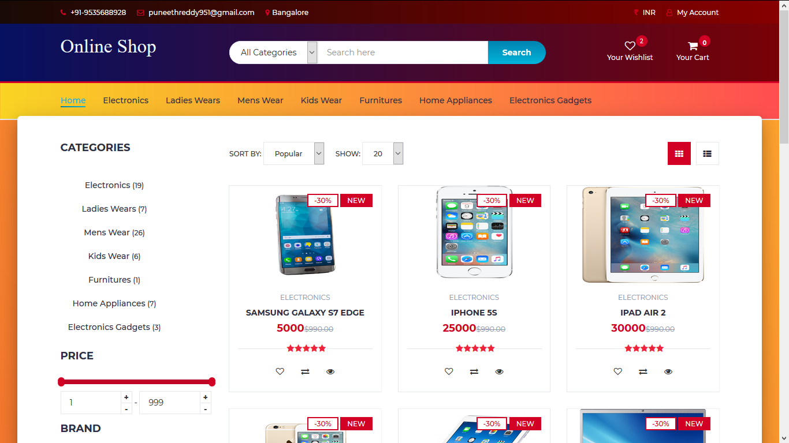
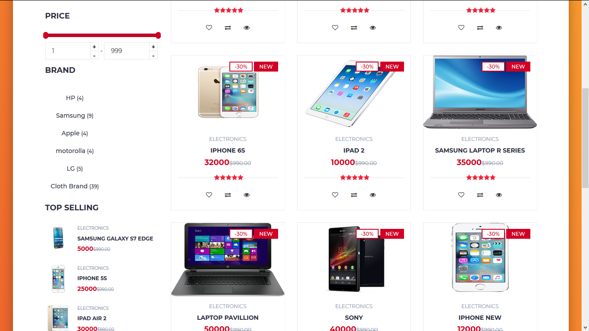

# Online Shopping System

online shopping system is a [DBMS project] with both admin and user layouts.

## Installation

1>Install XAMPP or WAMPP.

2>Open XAMPP Control panal and start [apache] and [mysql] .

3>Download project from github(https://github.com/Kote1997/OnlineShoppingSystem).
 
 OR follow gitbash commands

    i>cd C:\\xampp\htdocs\

    ii>git clone https://github.com/Kote1997/OnlineShoppingSystem

4>extract files in C:\\xampp\htdocs\.

5> open link localhost/phpmyadmin

6>click on new at side navbar.

8>give a database name as (onlineshop) hit on create button.

9>after creating database name click on import.

10>browse the file in directory [OnlineShoppingSystem/database/onlineshop.sql].

11>open any browser and type http://localhost/OnlineShoppingSystem.

12>first register and then login

13>admin login details  Email=admin@gmail.com and Password=123456789.

## If you like my project hit a start

## Screenshots

## Contributing
Pull requests are welcome. For major changes, please open an issue first to discuss what you would like to change.

Please make sure to update tests as appropriate.

